# Floral Fantasy (Milestone Project 4)

## Overview

This full-stack web application is an e-commerce platform built for a flower shop that offers bouquets, bridal arrangements, and seasonal products. The site includes a responsive landing page, secure authenticaiton system (account creation, login, and logout), and a user profile page that displays personal details and order history. User can add items to a cart, upadate or remove it, review their selections, and complete purchases through an integrated Stripe payment gateway, ensuring secure and realible transaction. The backend is powered by **Django**, with **PostgreSQL** as the database, and a front-end built using **HTML**, **CSS**, **Bootstrap**, and **JavaScript**. For deployment, the project is hosted on **Heroku**, ensuring scalability and accessibility for real-world use. In addition, **AWS S3 buckets** is used for storing static and media files. This provides efficient, reliable, and scalable storage, ensuring that all assets are delivered quickly and securely to users.
This applicaiton deliveres both strong functionality and clean, user-friendly interface, offering a seamless shopping experience from browsing products to completing secure transactions.

## Table of Contents
* [Overview](#overview)
* [Project Goals](#project-goals)
* [User Stories](#user-stories)
* [Features](#features)
* [Design Choices](#design-choices)
* [Technologies Used](#technologies-used)
* [Testing](#testing)
* [Deployment](#deployment)
* [Credits and Acknowledgement](#credits-and-acknowledgement)

## Project Goals

The goal of this project is to provide a seamless online shopping experience for a flower shop, allowing the users to browse the products, manage orders, and complete secure purchases. It aims to enhance convenience, trust, and engagement for users while supporting the business's e-commerce needs.

## User Stories

As a **User**, I want to:
- Sign up with my email and password so that I can create a personal account. And as a registered user, I want to log in/out so that my session and data stay secure.
- View my dashboard with past orders so that I can easily reorder my favourite bouquets.
- See all available bouquets with images, descriptions, and prices so that I can decide what to buy.
- See all the items I’ve added to my cart on one page, with clear options to update quantities or remove items, so I can easily manage my order before checking out.
- Enter my payment details including delivery address so that I can securely pay for my order and deliver it to me.
- See info/toast messages on every action (e.g., “Added to cart", or "Item removed"), so that I know whether my action succeeded.
- Search by name and filter by category, and sort by price or name, so that I can narrow down to exactly what I’m looking for.
- Enter promo codes at checkout, so that I can receive discounts on my order.
- As a user who forgotten password, I want to request a reset link so that I can regain access to my account.

As a **Site owner**:
- I want an admin interface to add/edit/delete bouquets (including images, price, category), so I can keep the inventory up to date.
- I want users to submit their questions through a contact form that send inquiries directly to my company email address, so I can easily view and respond to them without missing any messages.

The Flower Fantasy web app was built using **Agile Principles**, focusing on flexibility and learning from user feedback. Features were prioritised with the **MoSCoW Method** (dividing tasks into **Must-Have, SHould-Have, Could-Have, and WOn't-Have**) to make sure the essentials came first, while a **Kanban-style** workflow kept development organised and manageable. Working in short cycles allowed for regular testing and improvement, and a backlog of ideas was kept for future updates, leaving room to grow the app over time.

**GitHub Project in a Kanban board style**

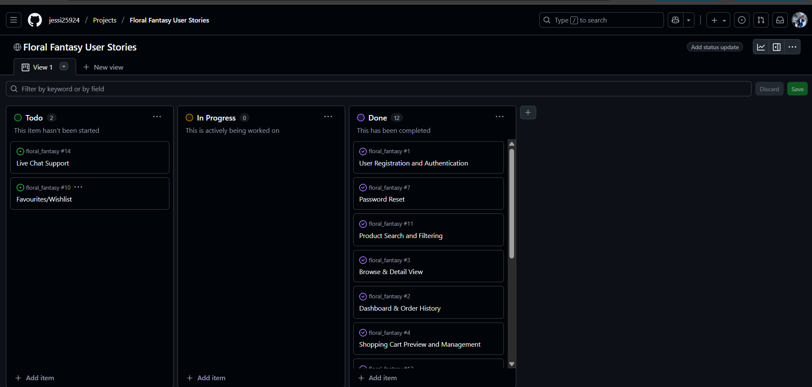

[Back To Top](#table-of-contents)

## Features

### Existing
This applicaiton incorporates a set of established features that collectively support the essential functions of an e-commerce platform, ensuring efficient product management, secure user authentication, and a seamless purchasing process for customers.

#### Header
The header provides intuitive site-wide navigation, including links to the Home page, Product listings, and a clickable logo that also redirects to the Home page. The navbar is initially transparent, but when the user scrolls down, it transitions to a solid background colour mathcing the footer, returning to transparent when scrolled back to the top.
A cart icon is always accessible, even to non-registered users, allowing products to be added and reviewed before checkout. A user account icon offers login and registration options, and once authenticated, expands to include quick access to the user's profile and logout option. If the logged-in user is a superuser, the header also displays a direct link to the Product Control for product management.

**
View Navigation Feature Screenshots Here
**

| Device / Comment      | Screenshot                                     |
| --------------------- | ---------------------------------------------- |
| **Desktop**           |    |
|            |    |
|            |    |
| **Desktop**/logged In User |  |
| **Desktop**/logged In Superuser |  |
| **Tablet**            |      |
| **Mobile**            |      |

#### Footer
The footer appears on all pages, displaying essentials business informaiton such as contact details, opening hours, social media links, and copyright notice. It is styled consistently with the overall site theme and is fully responsive across devices.

**
View Footer Feature Screenshots Here
**

| Device      | Screenshots                                  |
| ----------- | -------------------------------------------- |
| **Desktop** |  |
| **Tablet**  |    |
| **Mobile**  |    |

#### Landing Page
The landing page provides a brief history of the flower shop, highlights current seasonla discount codes, and features a contact form for inquiries, It offers seay acces to browse products, with prominent "Products" and "Shop Now" buttons that encourage users to explore and make purchases, serving as the main entry point for engagament and interaction.

**
View Landing Page Feature Screenshots Here
**

| Device      | Screenshots                                  |
| ----------- | -------------------------------------------- |
| **Desktop** |  |
|  |  |
|  | 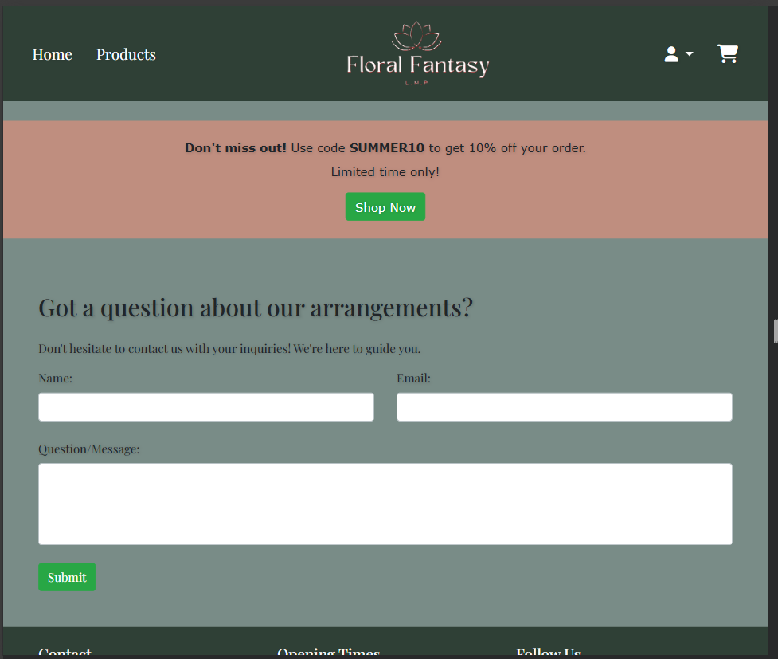 |
| **Tablet**  |    |
|   |    |
|   | 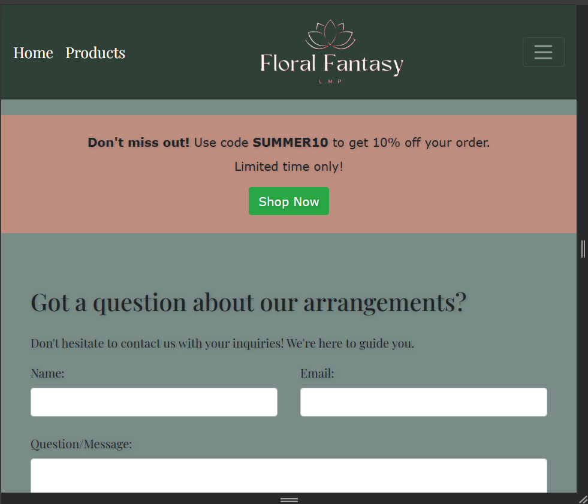   |
| **Mobile**  |    |
|   | 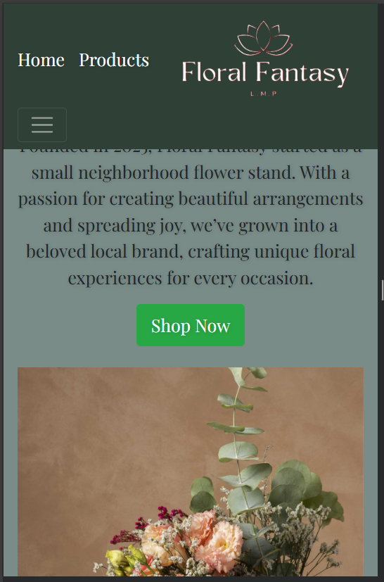   |
|   | 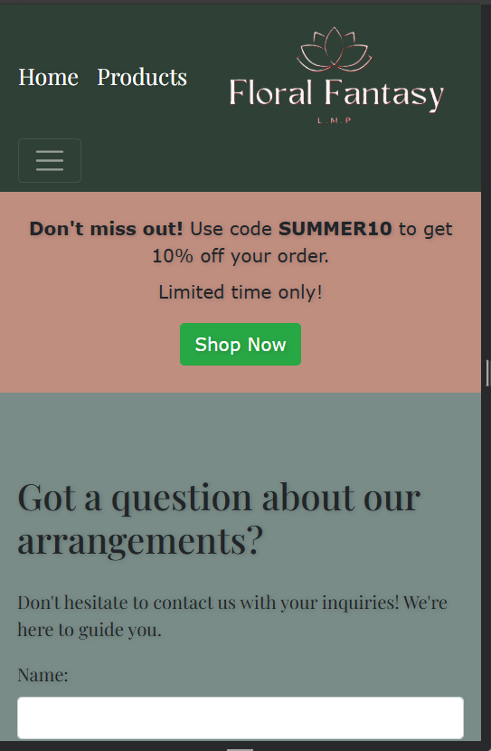   |

[Back To Landing Page](#landing-page)

#### Products Page
The products page displays all available bouquets products with a discount code banner on the top. Users can sort the items by price (low to high) or alphabetically, and use the search function to find products by friendly names such as 'sunflower' or 'hydrangeas'. To return to the full product listing, users can either clear the search entry and click the search icon or simply click the 'Products' link again. The page includes paginaiton controls, showing eight items per page with 'Next' and 'Prev' buttons for easy navigaiton.

**
View Products Page Feature Screenshots Here
**

| Device      | Screenshots                                  |
| ----------- | -------------------------------------------- |
| **Desktop** |  |
| **Tablet**  | 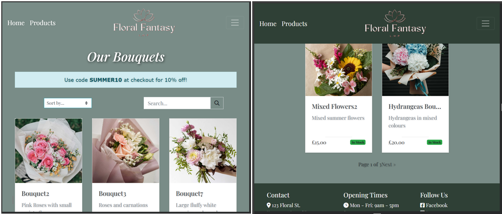   |
| **Mobile**  |    |

#### Product Details
The product details page showcases a selected bouquet with a prominent product image and comprehensive informaiton, including the product name, price, stock availability, a short description, and quantity selection. The page also provides actionable buttons, allowing users to add the item to their cart or return to the main product listing for further browsing.

**
View Product Details Feature Screenshots Here
**

| Device      | Screenshots                                  |
| ----------- | -------------------------------------------- |
| **Desktop** | 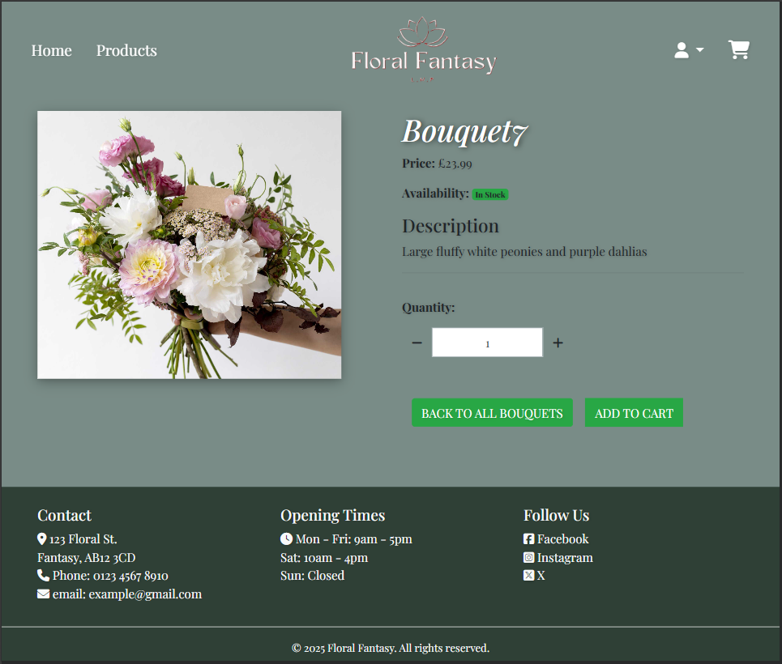 |
| **Tablet**  | 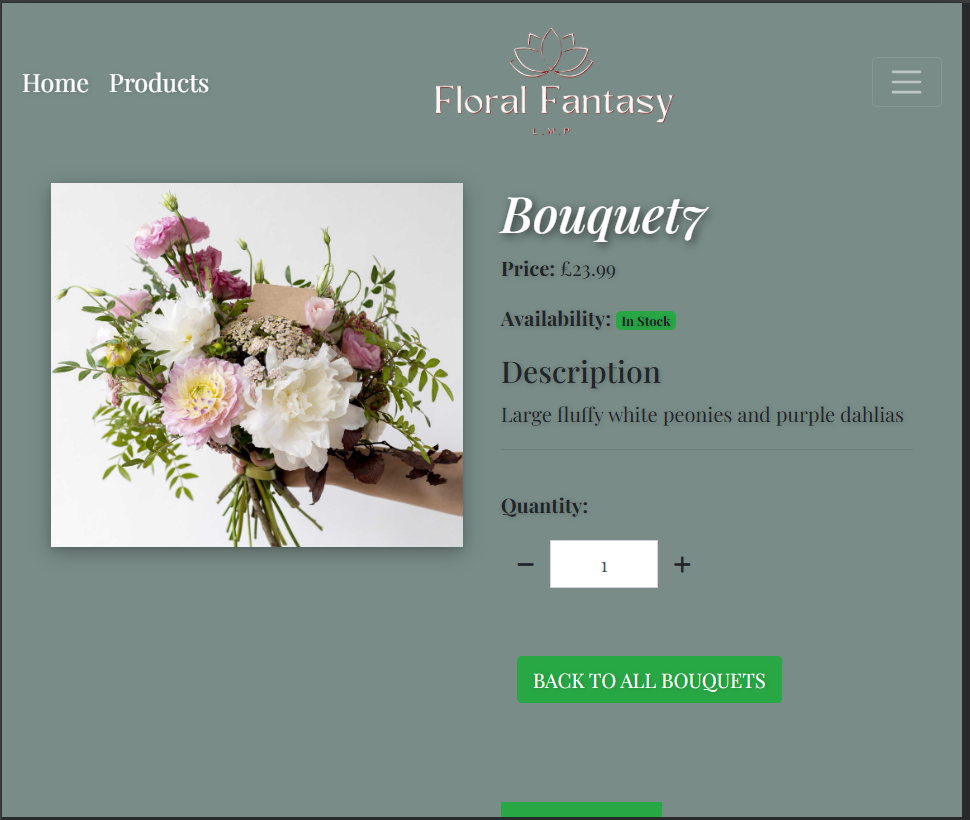   |
| **Mobile**  |    |

#### Cart Page
The cart page provides a clear overview of the users selected items. When the cart is empty, it displays a message stating "Your cart is empty" and a "Shop Now" button to redirect user to the products listing. When items are added, the cart icon reflects the subtotal, and the page lists each product with its name, price, adjustable quantity, total cost per item, and a 'remove' button for items the user wishes to delete. A summary seciton shows the subtotal, delivery cost, and grand total. The page also includes actionable buttons to "Continue Shopping" or "Proceed to Checkout", allowing users to either return to brwosing or complete their purchase.

**
View Cart Page Feature Screenshots Here
**

| Device/Comment      | Screenshots                                  |
| ----------- | -------------------------------------------- |
| **Empty Cart** | 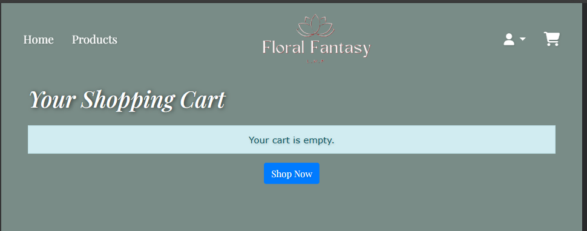 |
| **Desktop** | 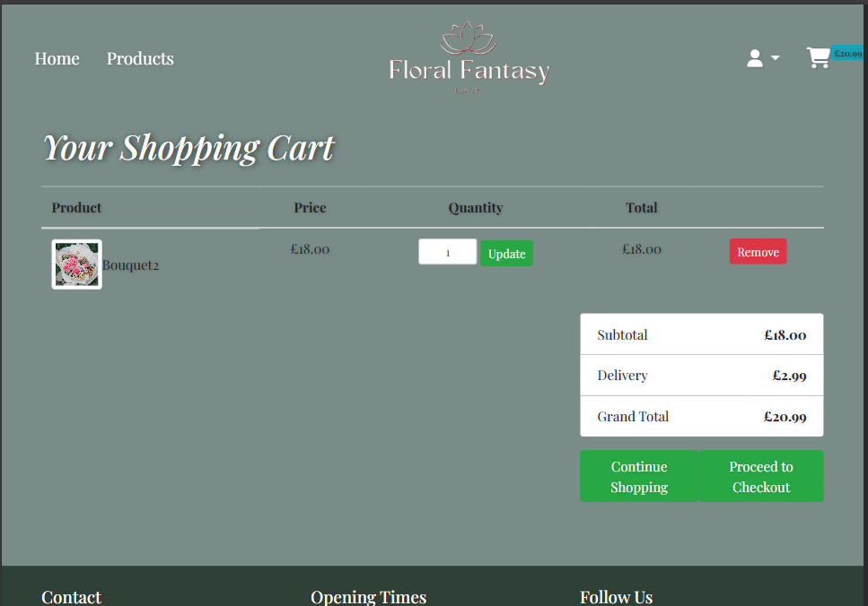 |
| **Tablet**  |    |
| **Mobile**  |    |

#### Checkout Page

### Contact Form

#### Signup Form

#### Login 

#### Logout

#### Password Reset

#### User's Profile Page

#### Product Control (Admin)

#### Admin Panel

### Future Feature
- Live support Chat - to enhance customer service, a rela-time support chat will be integrated, allowing users to quickly connect with the staff for assistance, product inquiries, and order-related directly within the site.

- Favourites/Wishlist - a favourites list feature will be introduced so users can save and revisit products they are interested in. This will improve the shopping experience by making it easier for customers to keep track of preferred items and purchase them later.

[Back To Top](#table-of-contents)

## Design Choices
### Entity Relationship Diagram (ERD)
The database structure is centered around four main models: UserProfile, Category, Product, and Order, with OrderLineItem providing the detailed breakdownof each order. The UserProfile model stores customer's name, email address and their order history. The Category model organises product into logical groups, while the Product model defines individual items available for puchase, including their descriptions, prices, and availability. The Order model records customer purchases, payment details, delivery information, discounts and status, while OrderLineItem connects products to orders, capturing the specific items and quantities purchased.
Together, these models create a relational structure that supports customer management, product catalog organisation, and end-to-end order processing in the system.

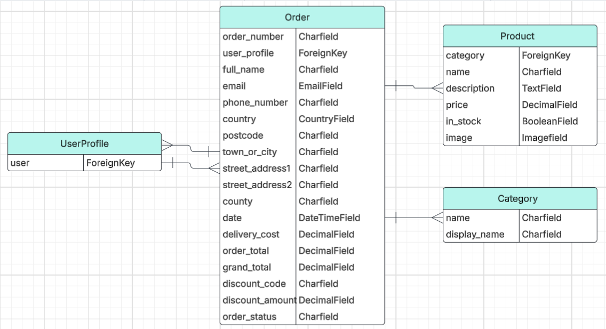

### Wireframe
The initial layout concept were first sketched on paper to map out ideas quickly, then refine into digital wireframes using **Balsamiq**. These wireframes provided a clear visual blueprint for the site's structure and layout before development began. They guided the planning of user flows, informed design decisions, and ensured the site would deliver a smooth and consistent experience across different screen sizes.

**
Balsamiq Wireframes
**

| Page                     | Screenshot (Mobile, Tablet, Desktop)                                       |
| ------------------------ | -------------------------------------------------------------------------- |
| **Home**                 |                             |
| **Products**               | 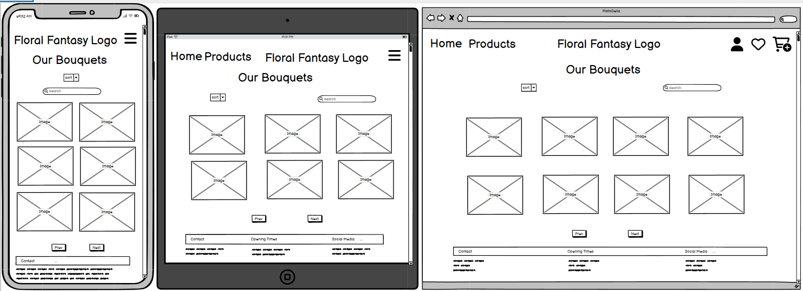                        |
| **Products Details**               |                              |
| **Profile**         |                  |
| **Cart** | 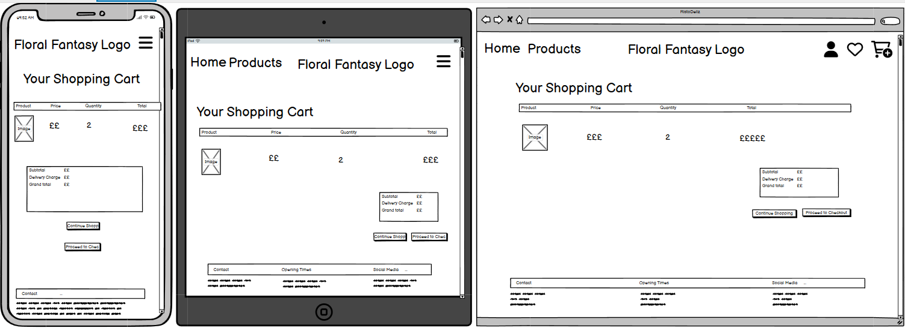 |
| **Checkout**                 |                                  |
| **Order Success**                |                                |
| **Sign Up**            |                        |
| **Log In**         | 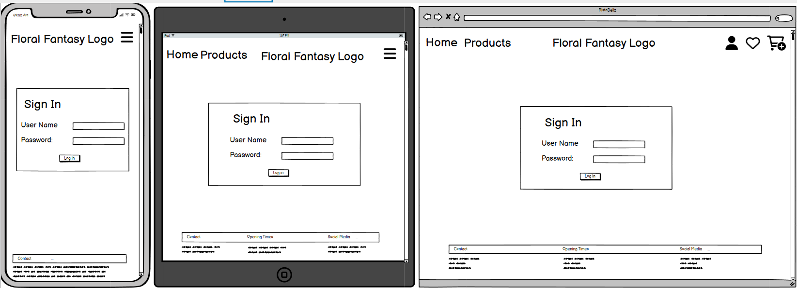                 |
| **Log Out**       |              |
| **Reset Password**  | 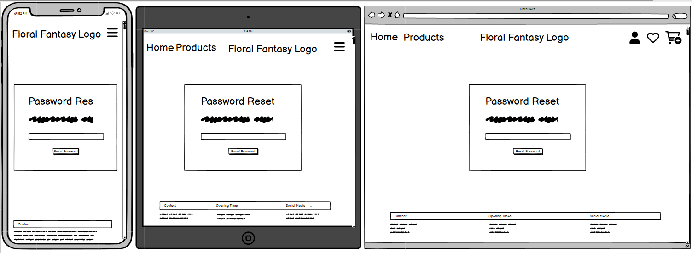   |
| **Product Management**  | 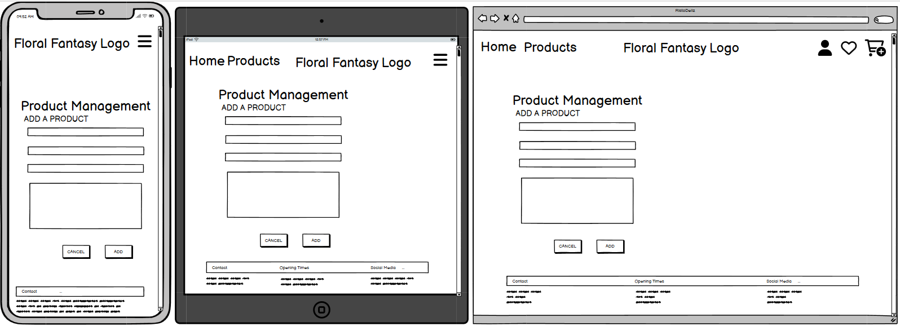   |

### Font
Playfair Dsiplay, sourced from [Google Fonts](https://fonts.google.com/specimen/Playfair+Display) was chosen for its elegant and sophisticated style, which complements the floral theme of the shop and enhances the overall visual appeal of the site.

### Colour Scheme
The colour theme was generated in [Adobe Color](https://color.adobe.com/create/image) using the hero image background as the source, ensuring the palette harmonises with the site's central imagery. This approach creates a cohensive visual identity that reflect the brand's floral character while maintaining warmth, elegance, and readability across the site.

[Back To Top](#table-of-contents)

## Technologies Used
### Languages
### Frameworks
### Platform
### Libraries
### Tools
### Email Services

[Back To Top](#table-of-contents)

## Testing

[Back To Top](#table-of-contents)

## Deployment

[Back To Top](#table-of-contents)

## Credits and Acknowledgement

[Back To Top](#table-of-contents)