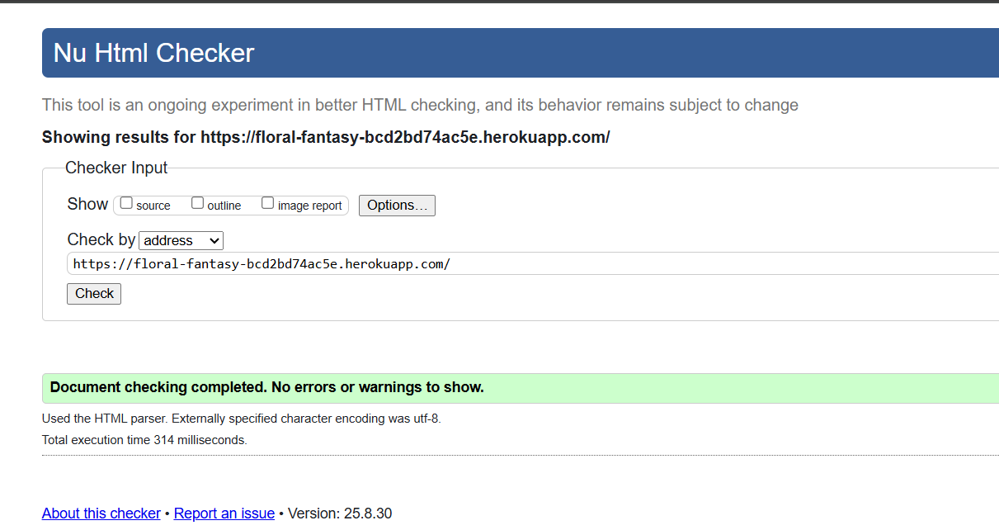
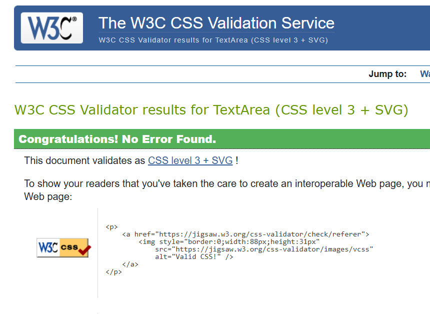
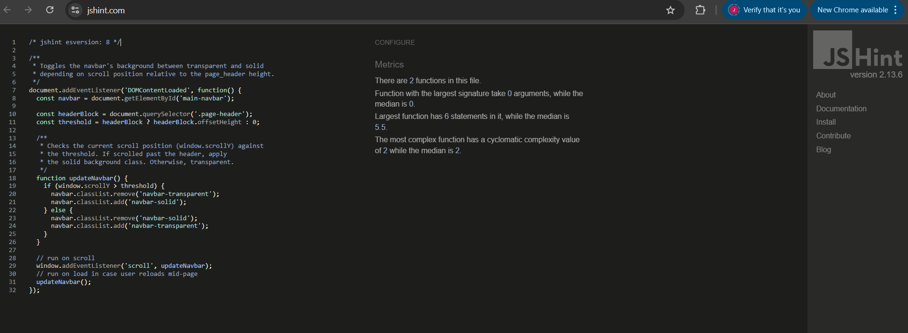
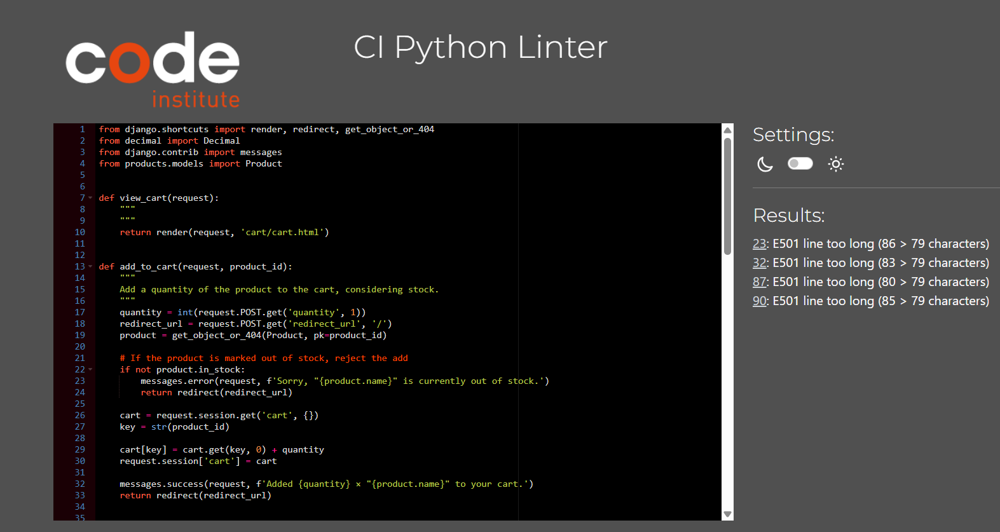
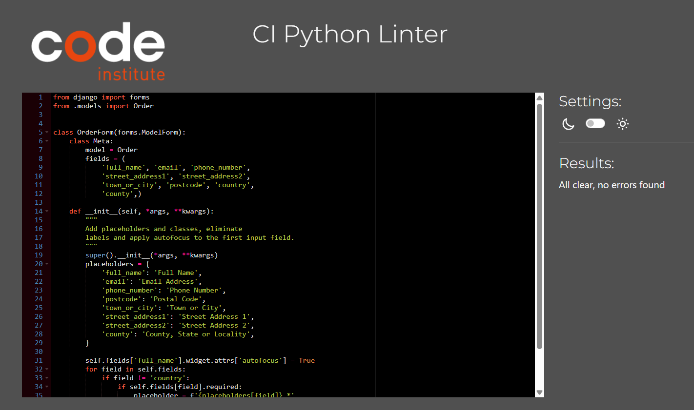
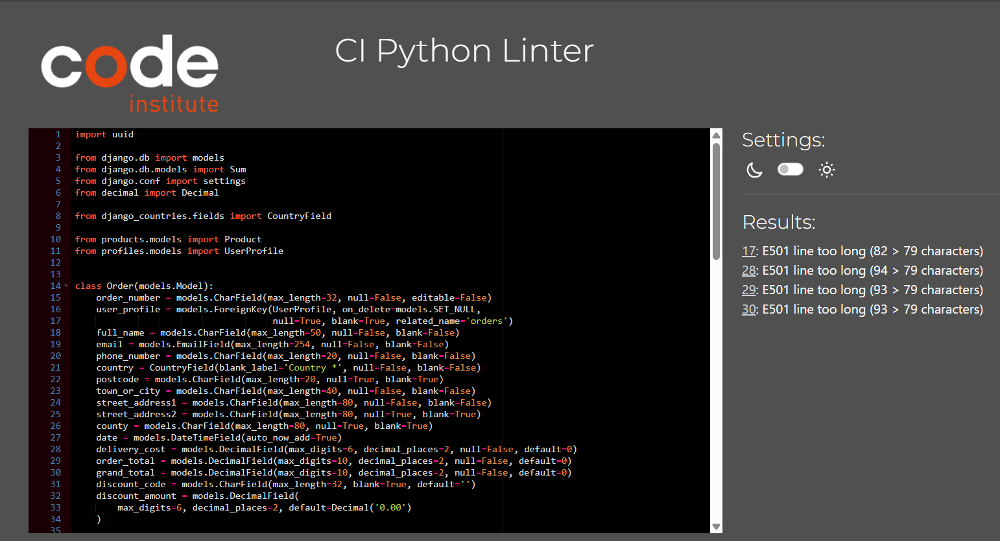
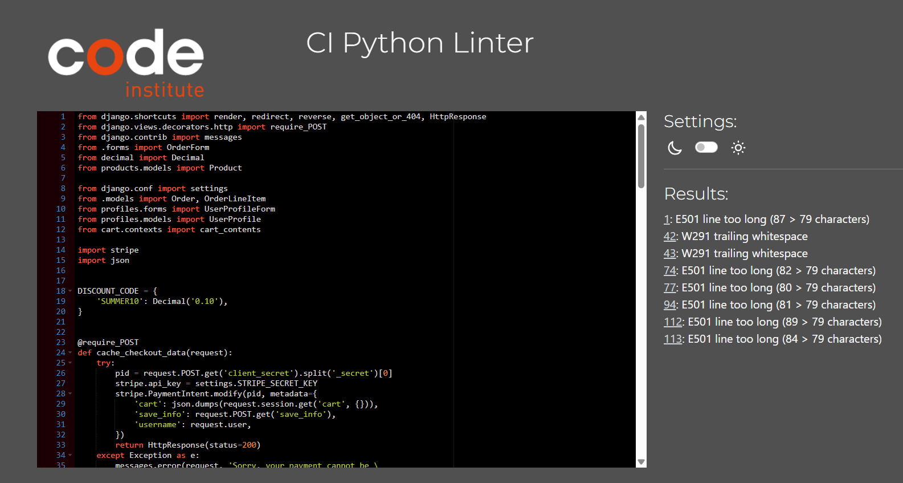
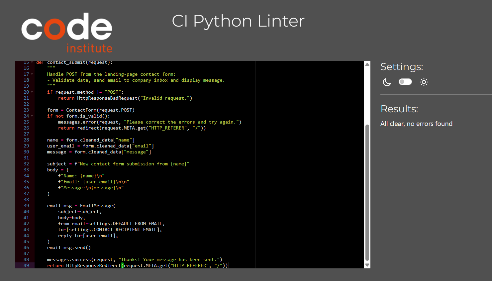
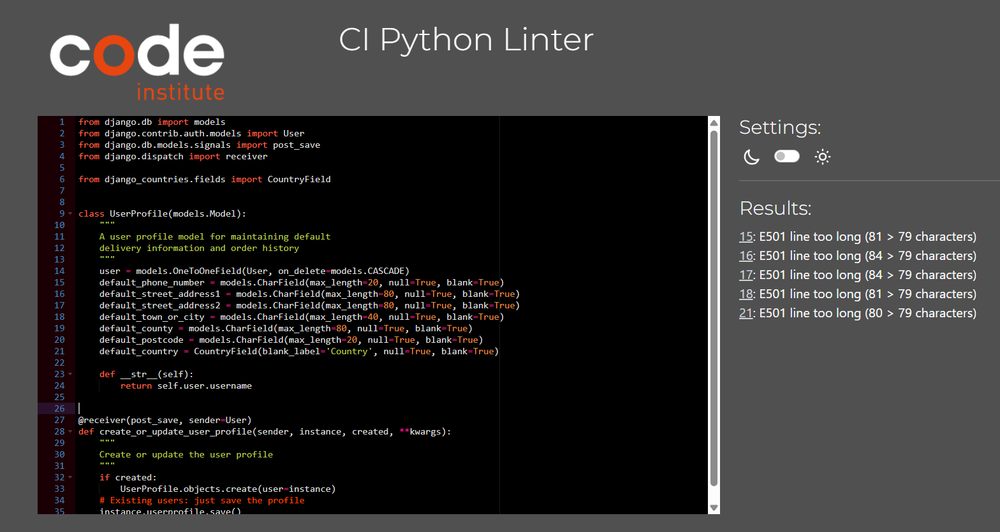

# Testing
A comprehensive testing strategy was essential for this project. It combines manual testing of all user stories and funcitonality with automated tests to ensure code reliability and data integrity. This approach guarantees a robust and user-friendly application.

## Table of Contents
* [Validation](#validation)
* [Lighthouse](#lighthouse)
* [Responsiveness](#responsiveness)
* [Browser Compatibility](#browser-compatibility)
* [Automated Testing](#automated-testing)
* [Manual Testing](#manual-testing)
* [User Stories](#user-stories)
* [Bugs](#bugs)

## Validation
### HTML
- To validate all HTML files, the recommended validator service by Code Institute which is [HTML Validator](https://validator.w3.org/) was used.

 
**
 View HTML Code Validation 
**

| Validation URL used      | Comment   | Screenshot         |  |
| --------- | --------- | ------------------ | ------ |
|  https://floral-fantasy-bcd2bd74ac5e.herokuapp.com/     | No Errors |  |  |

### CSS
- To validate the CSS file, the recommended validator service by Code Institute which is [CSS Validator](https://jigsaw.w3.org/css-validator/) was used.

 
 **
 View CSS Code Validation 
**

| File                                          | Comment  | Screenshot                                    |
| -------------------------------------------------- | -------- | --------------------------------------------- |
| **CSS Static** | No Error |  |
| **profile.css** | No Error |  |
| **checkout.css** | No Error |  |

### JavaScript
- To validate the JavaScript file, the recommended validator service by Code Institute which is [JSHint](https://jshint.com/) was used.

 
 **
 View JavaScript Code Validation 
**

| File                                          | Comment  | Screenshot                                    |
| -------------------------------------------------- | -------- | --------------------------------------------- |
| **Static JS Navbar** | No Error |  |
| **JS checkout** | No Error |  |

### Python
- To validate Python code, the recommended validator service by Code Institute which is [Python PEP8 Checker](https://ww7.pep8online.com/?usid=24&utid=12257950545) was used.

 
 **
 View Python Code Validation 
**

| File              | Comment | Screenshot         |
| ----------------- | ------- | ------------------ |
| **floral_fantasy**   |         |                    |
| **settings.py**    | *Line exceeds recommended length; left as-is for readability and to avoid further warnings *        |  |
| **Cart**   |         |                    |
| **views.py**        |    **     |  |
| **Checkout** |         |                    |
| **admin.py**      |    No error     |  |
| **forms.py**      |    No error     |  |
| **models.py**     |    **     | |
| **test.py**     |    No error     | |
| **views.py**      |    **     |  |
| **Landing/HomePage** |         |                    |
| **test.py**      |    **     |  |
| **views.py**      |    No error     |  |
| **Products** |         |                    |
| **models.py**      |    No error     |  |
| **views.py**      |    **     |  |
| **Profile** |         |                    |
| **models.py**      |    **     |  |
| **test.py**      |    **     |  |
| **views.py**      |    **     |  |

 

[Back To Top](#table-of-contents)

## Lighthouse
- For auditing Performance, Accessibility, and Best Practices [Developer Tools Lighthouse](https://developer.chrome.com/docs/lighthouse/overview/) was used.

 

 
 **
 View Lighthouse Testing 
**

| Device      | Page         | Screenshot                                   |
| ----------- | ------------ | -------------------------------------------- |
| **Desktop** | Home         |  |
| **Mobile**  | Home         |  |
| **Desktop** | Products         |  |
| **Mobile**  | Products         |  |
| **Desktop** | Product Details |  |
| **Mobile**  | Product Details |  |
| **Desktop** | Cart   |  |
| **Mobile**  | Cart   |  |
| **Desktop** | Checkout |  |
| **Mobile**  | Checkout |  |
| **Desktop** | Profile         |  |
| **Mobile**  | Profile         |  |

 

## Responsiveness

## Browser Compatibility

[Back To Top](#table-of-contents)

## Automated testing
### (the rest of automated testing)
### Stripe/Webhook

[Back To Top](#table-of-contents)

## Manual Testing
### Navbar
### Footer
### Landing Page Buttons
### (the rest of the web app functionality)

[Back To Top](#table-of-contents)

## User Stories

## Bugs
[Back To Top](#table-of-contents)