# Testing
A comprehensive testing strategy was essential for this project. It combines manual testing of all user stories and funcitonality with automated tests to ensure code reliability and data integrity. This approach guarantees a robust and user-friendly application.

## Table of Contents
* [Validation](#validation)
* [Lighthouse](#lighthouse)
* [Responsiveness](#responsiveness)
* [Browser Compatibility](#browser-compatibility)
* [Automated Testing](#automated-testing)
* [Manual Testing](#manual-testing)
* [User Stories](#user-stories)
* [Bugs](#bugs)

## Validation
### HTML
- To validate all HTML files, the recommended validator service by Code Institute which is [HTML Validator](https://validator.w3.org/) was used.

 
**
 View HTML Code Validation 
**

| Validation URL used      | Comment   | Screenshot         |  |
| --------- | --------- | ------------------ | ------ |
|  https://floral-fantasy-bcd2bd74ac5e.herokuapp.com/     | No Errors |  |  |

### CSS
- To validate the CSS file, the recommended validator service by Code Institute which is [CSS Validator](https://jigsaw.w3.org/css-validator/) was used.

 
 **
 View CSS Code Validation 
**

| File                                          | Comment  | Screenshot                                    |
| -------------------------------------------------- | -------- | --------------------------------------------- |
| **CSS Static** | No Error |  |
| **profile.css** | No Error | 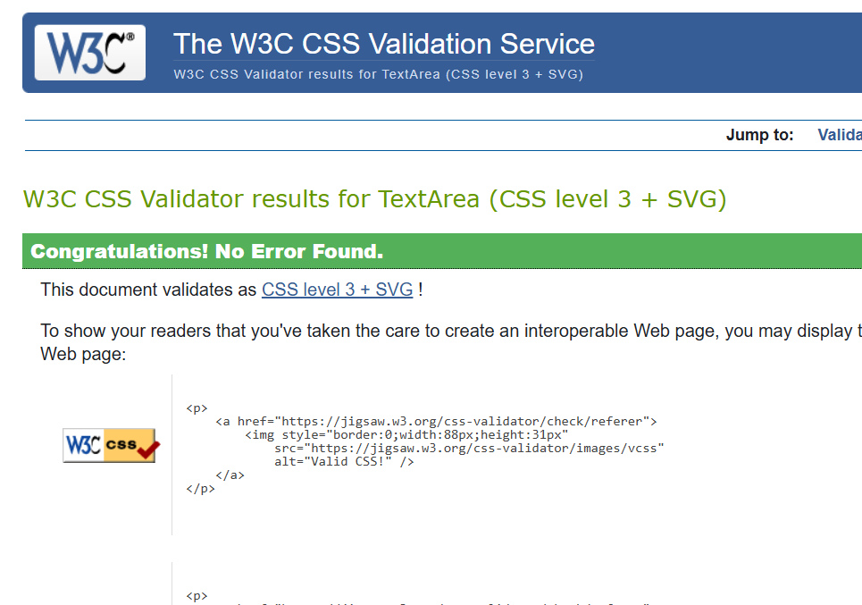 |
| **checkout.css** | No Error | 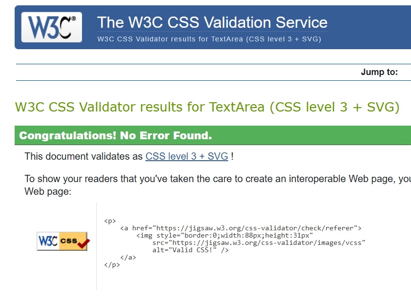 |

### JavaScript
- To validate the JavaScript file, the recommended validator service by Code Institute which is [JSHint](https://jshint.com/) was used.

 
 **
 View JavaScript Code Validation 
**

| File                                          | Comment  | Screenshot                                    |
| -------------------------------------------------- | -------- | --------------------------------------------- |
| **Static JS Navbar** | No Error |  |
| **JS checkout** | No Error |  |

### Python
- To validate Python code, the recommended validator service by Code Institute which is [Python PEP8 Checker](https://ww7.pep8online.com/?usid=24&utid=12257950545) was used.

 
 **
 View Python Code Validation 
**

| File              | Comment | Screenshot         |
| ----------------- | ------- | ------------------ |
| **floral_fantasy**   |         |                    |
| **settings.py**    | *Line exceeds recommended length; left as-is for readability and to avoid further warnings *        |  |
| **Cart**   |         |                    |
| **views.py**        |    **     |  |
| **Checkout** |         |                    |
| **admin.py**      |    No error     | 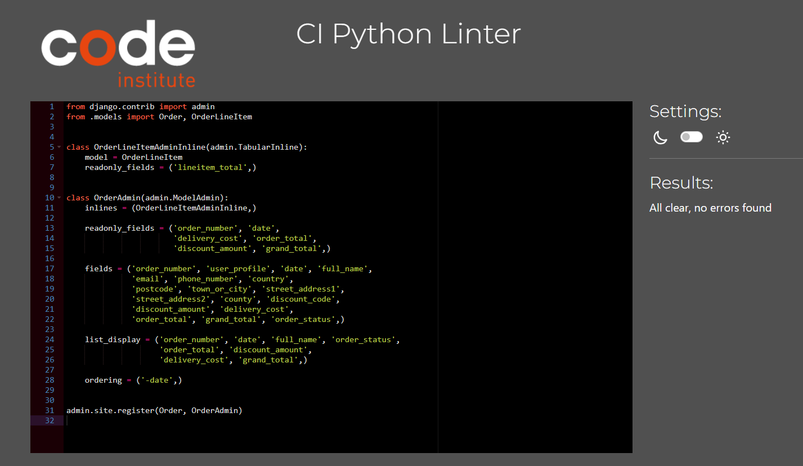 |
| **forms.py**      |    No error     |  |
| **models.py**     |    **     | |
| **test.py**     |    No error     | 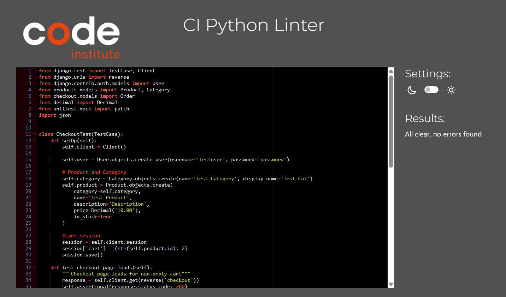|
| **views.py**      |    **     |  |
| **Landing/HomePage** |         |                    |
| **test.py**      |    **     |  |
| **views.py**      |    No error     |  |
| **Products** |         |                    |
| **models.py**      |    No error     | 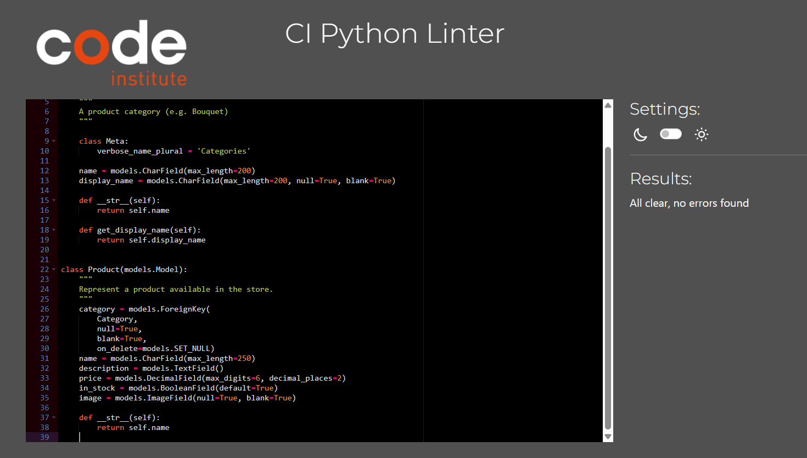 |
| **views.py**      |    **     |  |
| **Profile** |         |                    |
| **models.py**      |    **     |  |
| **test.py**      |    **     | 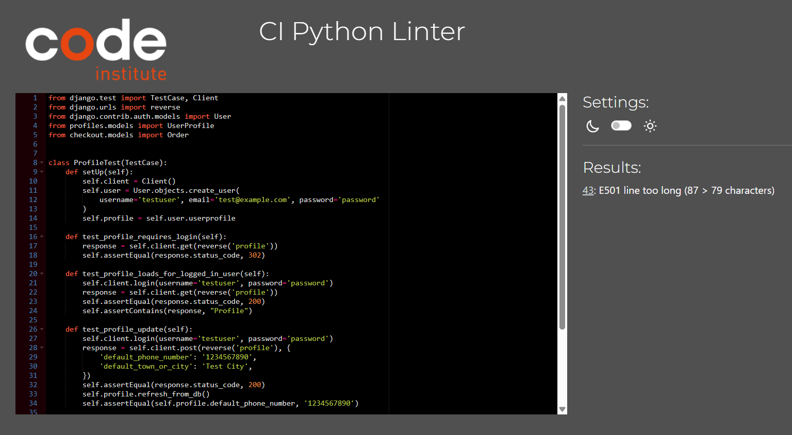 |
| **views.py**      |    **     | 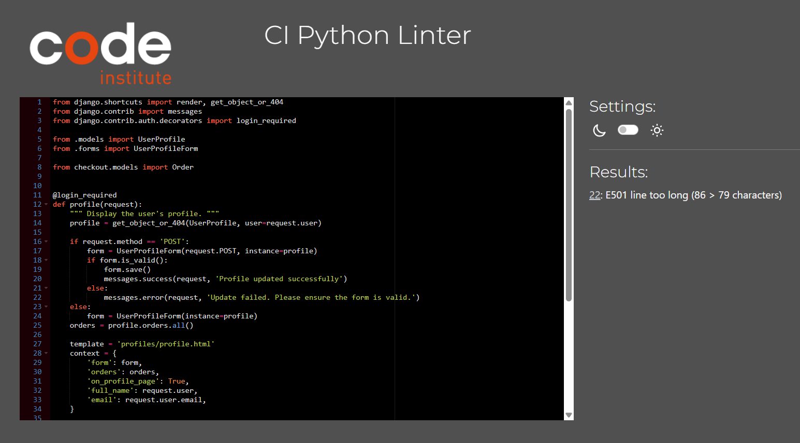 |

 

[Back To Top](#table-of-contents)

## Lighthouse
- For auditing Performance, Accessibility, and Best Practices [Developer Tools Lighthouse](https://developer.chrome.com/docs/lighthouse/overview/) was used.

 

 
 **
 View Lighthouse Testing 
**

| Device      | Page         | Screenshot                                   |
| ----------- | ------------ | -------------------------------------------- |
| **Desktop** | Home         |  |
| **Mobile**  | Home         |  |
| **Desktop** | Products         |  |
| **Mobile**  | Products         |  |
| **Desktop** | Product Details |  |
| **Mobile**  | Product Details |  |
| **Desktop** | Cart   |  |
| **Mobile**  | Cart   |  |
| **Desktop** | Checkout |  |
| **Mobile**  | Checkout |  |
| **Desktop** | Profile         |  |
| **Mobile**  | Profile         |  |

 

## Responsiveness
- The application was tested to ensure it will respond correctly on desktop, tablet, and mobile devices, maintaining usability and layout integrity.

 
 **
View Responsiveness Screenshot on Different Devices
**

| Device      | Comment | Screenshot             |
| ----------- | ---------| ------------- |
| **20" Desktop 1600x900** |  [ResponsiveChecker](https://responsivedesignchecker.com/)  | |
| **Laptop 1024x868**  |   Chrome(devtools)     |  |
| **15" Notebook 1366x768**  |   [ResponsiveChecker](https://responsivedesignchecker.com/)     |  |
| **iPad Mini 768x1024**  | [ResponsiveChecker](https://responsivedesignchecker.com/)   |  |
| **Samsung Galaxy Tab10 800x1280**  | [ResponsiveChecker](https://responsivedesignchecker.com/)       |  |
| **iPhone 414x736**  |  [ResponsiveChecker](https://responsivedesignchecker.com/)      |  |
| **Mobile 425x651**  |   Chrome(devtools)     |  |

## Browser Compatibility
- The application was tested for basic compatibility on major browsers including Chrome, Firefox, MS Edge and Opera. Core functionality and layout appeared consistent across these browsers.

 
 **
View Compatibility Screenshot on Different Browser
**

| Browser     | Comment | Screenshot             |
| ----------- | ------- | ---------------------- |
| **Chrome**  |   Performs as intended      |  |
| **Firefox** |   Performs as intended      | 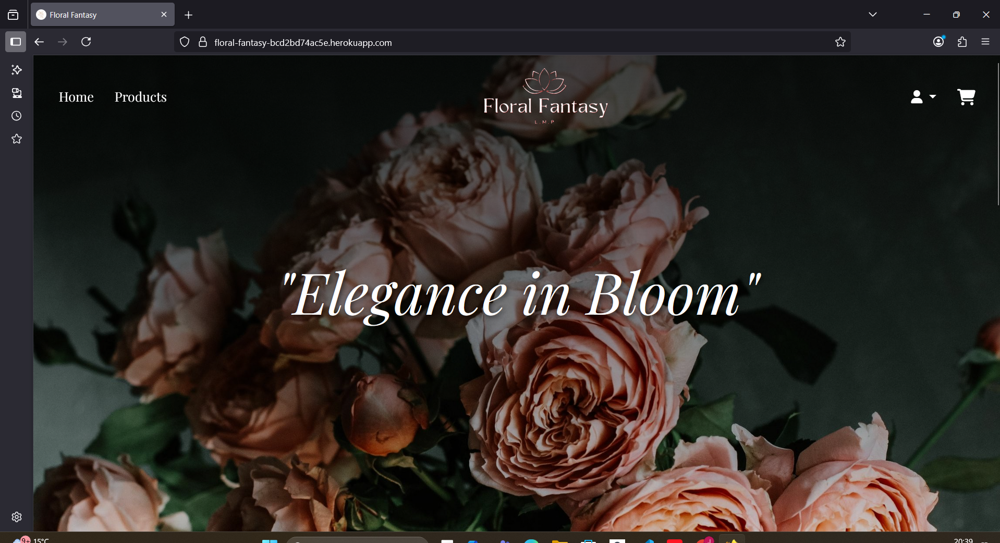 |
| **MS Edge** |   Performs as intended      | 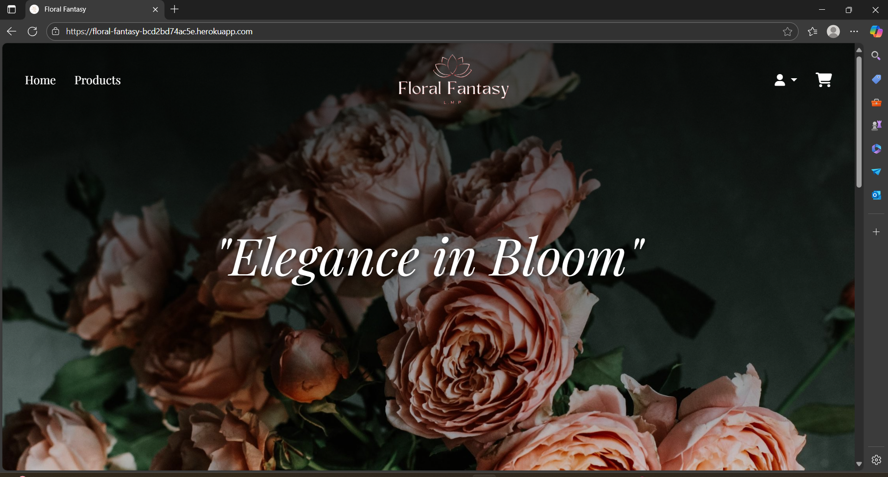 |
| **Opera**   |   Performs as intended      | 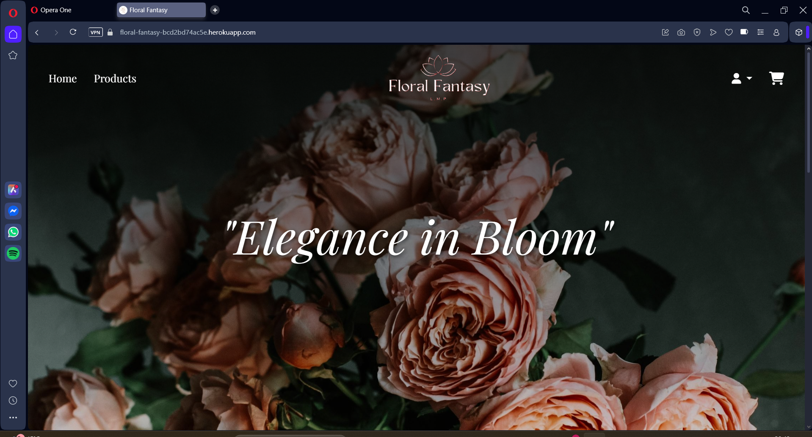 |

[Back To Top](#table-of-contents)

## Automated testing
Automated test help ensure reliability and support continuous integration by checking that models, views, and other components work as expected. 

 
 **
View Automated Testing
**

| Apps/File     | Comment | Screenshot             |
| ----------- | ------- | ---------------------- |
| **Cart**  |   Performs as intended      |  |
| **Checkout** |   Performs as intended      |  |
| **Landing/Home** |   Performs as intended      |  |
| **Products**   |   Performs as intended      |  |
| **Profile**   |   Performs as intended      |  |
| **Webhook**   |   Performs as intended      |  |

### Stripe/Webhook
Stripe webhooks allow the application to receive real-time notifications for events like payments and updates. These were tested both locally using the Stripe CLI in the terminal and on the deployed applicaiton to ensure secure handling and proper synchronisation with Stripe.

 
 **
View Stripe Testing
**

| Testing     | Comment | Screenshot             |
| ----------- | ------- | ---------------------- |
| **Stripe CLI**  |        |  |
|  |         |  |
|  |   Performs as intended      | 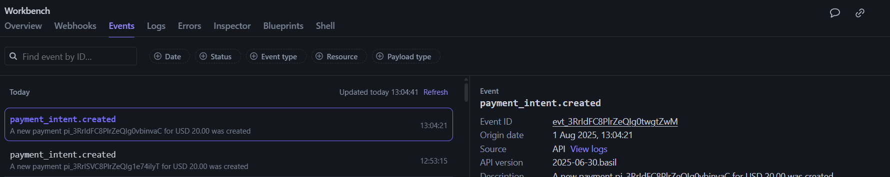 |
|  |         | 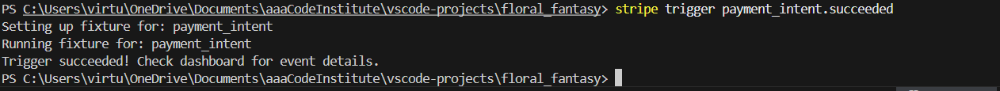 |
|  |   Performs as intended      | 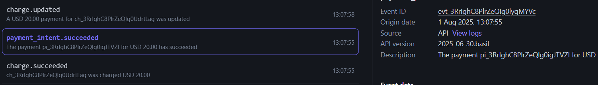 |
|  |         |  |
|  |   Performs as intended      |  |
| **Events**   |   based on deployed App     |  |
|    |   Performs as intended      |  |
|    |   Performs as intended      | 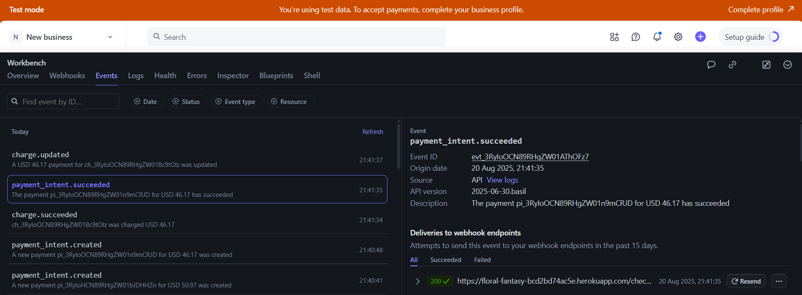 |
|    |   Performs as intended      |  |

[Back To Top](#table-of-contents)

## Manual Testing
All core features and user interactions of the application were manually tested to ensure proper funcitonality. This include checking buttons, forms, navigation, and workflows across the app to confirm that each component behaves as expected.

### Navbar
| Comment | Screenshot             |
| ------- | ---------------------- |
| **solid navbar** | 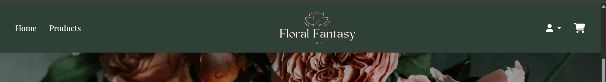 |
| **navbar** |  |
| **logged in user** |  |
| **superuser** | 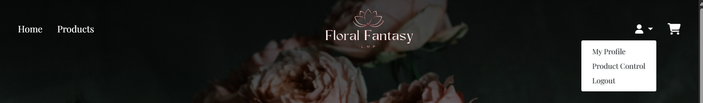 |

| Action | Expected Result | Comment |
| --------------------- | -------------------------------------- | ---------------------------------------- |
| click on logo | should navigate to homepage | **Pass**- Achieves desired functionality |
| click on Home | should navigate to homepage | **Pass**- Achieves desired functionality |
| click on Products | should navigate to product list page | **Pass**- Achieves desired functionality |
| click on Cart Icon | should navigate to cart page | **Pass**- Achieves desired functionality |
| click on User Icon | (not logged in/new user) should have access to login/signup page | **Pass**- Achieves desired functionality |
| click on User Icon | (logged in user) should have access to profile/logout page | **Pass**- Achieves desired functionality |
| click on User Icon | (logged in superuser) should have access to profile/product control/logout page | **Pass**- Achieves desired functionality |
| click on Sign Up | should navigate to signup page | **Pass**- Achieves desired functionality |
| click on Log In | should navigate to login page | **Pass**- Achieves desired functionality |
| click on My Profile | should navigate to user's dashboard | **Pass**- Achieves desired functionality |
| click on Log Out | logged out and redirect to log in page | **Pass**- Achieves desired functionality |

### Footer

| Action | Expected Result | Comment |
| ----------------------- | ---------------------------------------------------------- | ---------------------------------------- |
| click on Facebook Icon | should navigate to the facebook page in a separate window | **Pass**- Achieves desired functionality |
| click on Instagram Icon | should navigate to the instagram page in a separate window | **Pass**- Achieves desired functionality |
| click on X Icon | should navigate to the x page in a separate window | **Pass**- Achieves desired functionality |

### Landing Page Buttons
| Comment | Screenshot             |
| ------- | ---------------------- |
| **Shop Now button** |  |
| **Shop Now button** | 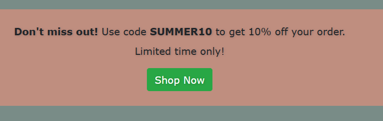 |
| **Submit button** | 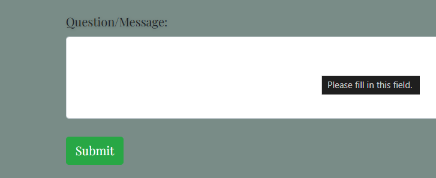 |

| Action                                     | Expected Result                             | Comment                                  |
| ------------------------------------------ | ------------------------------------------- | ---------------------------------------- |
| click on Shop Now                      | should navigate to Product Listing page        | **Pass**- Achieves desired functionality |
| click on Submit               | should submit the forms             | **Pass**- Achieves desired functionality |

### Products Page
| Comment | Screenshot             |
| ------- | ---------------------- |
| **Products Page** |  |
|  | 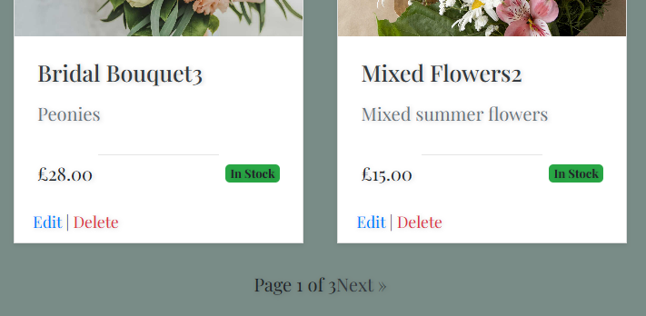 |

| Action                                     | Expected Result                             | Comment                                  |
| ------------------------------------------ | ------------------------------------------- | ---------------------------------------- |
| click on Product Item                      | should navigate to Product details page        | **Pass**- Achieves desired functionality |
| click on Sort by                      | should sort the products by price(low-high, high-low) or alphabetical        | **Pass**- Achieves desired functionality |
| click on Search                      | user can search products, clicking the search icon with no text shows all items.        | **Pass**- Achieves desired functionality |
| click on Edit|Delete                      | should give the superuser an access to edit or delete an item  | **Pass**- Achieves desired functionality |
| click on Prev or Next                      | should navigate to previous page or next page        | **Pass**- Achieves desired functionality |

### Products Details Page
### Cart Page
### Checkout Page
### My Profile Page
### SignUp Form
### Contact Form
### LogIn Page
### LogOut Page
### Reset Password Page

[Back To Top](#table-of-contents)

## User Stories

## Bugs
[Back To Top](#table-of-contents)