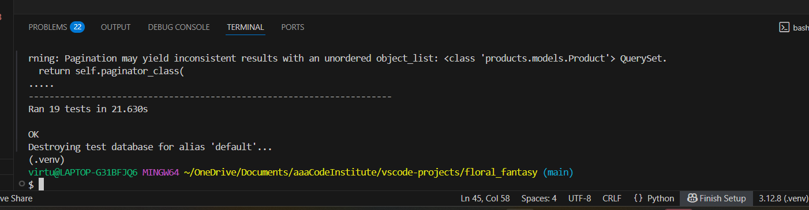
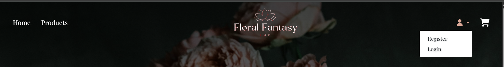

# Testing
A comprehensive testing strategy was essential for this project. It combines manual testing of all user stories and funcitonality with automated tests to ensure code reliability and data integrity. This approach guarantees a robust and user-friendly application.

## Table of Contents
* [Validation](#validation)
* [Lighthouse](#lighthouse)
* [Responsiveness](#responsiveness)
* [Browser Compatibility](#browser-compatibility)
* [Automated Testing](#automated-testing)
* [Manual Testing](#manual-testing)
* [User Stories](#user-stories)
* [Bugs](#bugs)

## Validation
### HTML
- To validate all HTML files, the recommended validator service by Code Institute which is [HTML Validator](https://validator.w3.org/) was used.

 
**
 View HTML Code Validation 
**

| Validation URL used      | Comment   | Screenshot         |  |
| --------- | --------- | ------------------ | ------ |
|  https://floral-fantasy-bcd2bd74ac5e.herokuapp.com/     | No Errors |  |  |

### CSS
- To validate the CSS file, the recommended validator service by Code Institute which is [CSS Validator](https://jigsaw.w3.org/css-validator/) was used.

 
 **
 View CSS Code Validation 
**

| File                                          | Comment  | Screenshot                                    |
| -------------------------------------------------- | -------- | --------------------------------------------- |
| **CSS Static** | No Error |  |
| **profile.css** | No Error |  |
| **checkout.css** | No Error |  |

### JavaScript
- To validate the JavaScript file, the recommended validator service by Code Institute which is [JSHint](https://jshint.com/) was used.

 
 **
 View JavaScript Code Validation 
**

| File                                          | Comment  | Screenshot                                    |
| -------------------------------------------------- | -------- | --------------------------------------------- |
| **Static JS Navbar** | No Error |  |
| **JS checkout** | No Error |  |

### Python
- To validate Python code, the recommended validator service by Code Institute which is [Python PEP8 Checker](https://ww7.pep8online.com/?usid=24&utid=12257950545) was used.

 
 **
 View Python Code Validation 
**

| File              | Comment | Screenshot         |
| ----------------- | ------- | ------------------ |
| **floral_fantasy**   |         |                    |
| **settings.py**    | *Line exceeds recommended length; left as-is for readability and to avoid further warnings *        |  |
| **Cart**   |         |                    |
| **views.py**        |    **     |  |
| **Checkout** |         |                    |
| **admin.py**      |    No error     |  |
| **forms.py**      |    No error     |  |
| **models.py**     |    **     | |
| **test.py**     |    No error     | |
| **views.py**      |    **     |  |
| **Landing/HomePage** |         |                    |
| **test.py**      |    **     |  |
| **views.py**      |    No error     |  |
| **Products** |         |                    |
| **models.py**      |    No error     |  |
| **views.py**      |    **     |  |
| **Profile** |         |                    |
| **models.py**      |    **     |  |
| **test.py**      |    **     |  |
| **views.py**      |    **     |  |

 

[Back To Top](#table-of-contents)

## Lighthouse
- For auditing Performance, Accessibility, and Best Practices [Developer Tools Lighthouse](https://developer.chrome.com/docs/lighthouse/overview/) was used.

 

 
 **
 View Lighthouse Testing 
**

| Device      | Page         | Screenshot                                   |
| ----------- | ------------ | -------------------------------------------- |
| **Desktop** | Home         |  |
| **Mobile**  | Home         |  |
| **Desktop** | Products         |  |
| **Mobile**  | Products         |  |
| **Desktop** | Product Details |  |
| **Mobile**  | Product Details |  |
| **Desktop** | Cart   |  |
| **Mobile**  | Cart   |  |
| **Desktop** | Checkout |  |
| **Mobile**  | Checkout |  |
| **Desktop** | Profile         |  |
| **Mobile**  | Profile         |  |

 

## Responsiveness
- The application was tested to ensure it will respond correctly on desktop, tablet, and mobile devices, maintaining usability and layout integrity.

 
 **
View Responsiveness Screenshot on Different Devices
**

| Device      | Comment | Screenshot             |
| ----------- | ---------| ------------- |
| **20" Desktop 1600x900** |  [ResponsiveChecker](https://responsivedesignchecker.com/)  | |
| **Laptop 1024x868**  |   Chrome(devtools)     |  |
| **15" Notebook 1366x768**  |   [ResponsiveChecker](https://responsivedesignchecker.com/)     |  |
| **iPad Mini 768x1024**  | [ResponsiveChecker](https://responsivedesignchecker.com/)   |  |
| **Samsung Galaxy Tab10 800x1280**  | [ResponsiveChecker](https://responsivedesignchecker.com/)       |  |
| **iPhone 414x736**  |  [ResponsiveChecker](https://responsivedesignchecker.com/)      |  |
| **Mobile 425x651**  |   Chrome(devtools)     |  |

## Browser Compatibility
- The application was tested for basic compatibility on major browsers including Chrome, Firefox, MS Edge and Opera. Core functionality and layout appeared consistent across these browsers.

 
 **
View Compatibility Screenshot on Different Browser
**

| Browser     | Comment | Screenshot             |
| ----------- | ------- | ---------------------- |
| **Chrome**  |   Performs as intended      |  |
| **Firefox** |   Performs as intended      |  |
| **MS Edge** |   Performs as intended      |  |
| **Opera**   |   Performs as intended      |  |

[Back To Top](#table-of-contents)

## Automated testing
Automated test help ensure reliability and support continuous integration by checking that models, views, and other components work as expected. 

 
 **
View Automated Testing
**

| Apps/File     | Comment | Screenshot             |
| ----------- | ------- | ---------------------- |
| **Cart**  |   Performs as intended      |  |
| **Checkout** |   Performs as intended      |  |
| **Landing/Home** |   Performs as intended      |  |
| **Products**   |   Performs as intended      |  |
| **Profile**   |   Performs as intended      |  |
| **Webhook**   |   Performs as intended      |  |

### Stripe/Webhook
Stripe webhooks allow the application to receive real-time notifications for events like payments and updates. These were tested both locally using the Stripe CLI in the terminal and on the deployed applicaiton to ensure secure handling and proper synchronisation with Stripe.

 
 **
View Stripe Testing
**

| Testing     | Comment | Screenshot             |
| ----------- | ------- | ---------------------- |
| **Stripe CLI**  |        |  |
|  |         |  |
|  |   Performs as intended      |  |
|  |         |  |
|  |   Performs as intended      |  |
|  |         |  |
|  |   Performs as intended      |  |
| **Events**   |   based on deployed App     |  |
|    |   Performs as intended      |  |
|    |   Performs as intended      |  |
|    |   Performs as intended      |  |

[Back To Top](#table-of-contents)

## Manual Testing
All core features and user interactions of the application were manually tested to ensure proper funcitonality. This include checking buttons, forms, navigation, and workflows across the app to confirm that each component behaves as expected.

### Navbar
| Comment | Screenshot             |
| ------- | ---------------------- |
| **solid navbar** |  |
| **navbar** |  |
| **logged in user** |  |
| **superuser** |  |

| Action | Expected Result | Comment |
| --------------------- | -------------------------------------- | ---------------------------------------- |
| click on logo | should navigate to homepage | **Pass**- Achieves desired functionality |
| click on Home | should navigate to homepage | **Pass**- Achieves desired functionality |
| click on Products | should navigate to product list page | **Pass**- Achieves desired functionality |
| click on Cart Icon | should navigate to cart page | **Pass**- Achieves desired functionality |
| click on User Icon | (not logged in/new user) should have access to login/signup page | **Pass**- Achieves desired functionality |
| click on User Icon | (logged in user) should have access to profile/logout page | **Pass**- Achieves desired functionality |
| click on User Icon | (logged in superuser) should have access to profile/product control/logout page | **Pass**- Achieves desired functionality |
| click on Sign Up | should navigate to signup page | **Pass**- Achieves desired functionality |
| click on Log In | should navigate to login page | **Pass**- Achieves desired functionality |
| click on My Profile | should navigate to user's dashboard | **Pass**- Achieves desired functionality |
| click on Log Out | logged out and redirect to log in page | **Pass**- Achieves desired functionality |

### Footer

| Action | Expected Result | Comment |
| ----------------------- | ---------------------------------------------------------- | ---------------------------------------- |
| click on Facebook Icon | should navigate to the facebook page in a separate window | **Pass**- Achieves desired functionality |
| click on Instagram Icon | should navigate to the instagram page in a separate window | **Pass**- Achieves desired functionality |
| click on X Icon | should navigate to the x page in a separate window | **Pass**- Achieves desired functionality |

### Landing Page Buttons
| Comment | Screenshot             |
| ------- | ---------------------- |
| **Shop Now button** |  |
| **Shop Now button** |  |
| **Submit button** |  |

| Action                                     | Expected Result                             | Comment                                  |
| ------------------------------------------ | ------------------------------------------- | ---------------------------------------- |
| click on Shop Now                      | should navigate to Product Listing page        | **Pass**- Achieves desired functionality |
| click on Submit               | should submit the forms             | **Pass**- Achieves desired functionality |

### Products Page
| Comment | Screenshot             |
| ------- | ---------------------- |
| **Products Page** |  |
|  |  |

| Action                                     | Expected Result                             | Comment                                  |
| ------------------------------------------ | ------------------------------------------- | ---------------------------------------- |
| click on Product Item                      | should navigate to Product details page        | **Pass**- Achieves desired functionality |
| click on Sort by                      | should sort the products by price(low-high, high-low) or alphabetical        | **Pass**- Achieves desired functionality |
| click on Search                      | user can search products, clicking the search icon with no text shows all items.        | **Pass**- Achieves desired functionality |
| click on Edit|Delete                      | should give the superuser an access to edit or delete an item  | **Pass**- Achieves desired functionality |
| click on Prev or Next                      | should navigate to previous page or next page        | **Pass**- Achieves desired functionality |

### Products Details Page
| Comment | Screenshot             |
| ------- | ---------------------- |
| **Superuser** |  |
| **User** |  |

| Action                                     | Expected Result                             | Comment                                  |
| ------------------------------------------ | ------------------------------------------- | ---------------------------------------- |
| On Quantity, Use + or - (or arrow keys) | should adjust the quantity, or enter the desired number directly        | **Pass**- Achieves desired functionality |
| click on Back To All Bouquets      | should navigate to Products List page        | **Pass**- Achieves desired functionality |
| click on Add to Cart  | should add the item in the cart with a clear message confirmation that it has been added        | **Pass**- Achieves desired functionality |
| click on Edit (superuser)    | should navigate to Product Management page for editing        | **Pass**- Achieves desired functionality |
| click on Delete (superuser)  | should delete the item with a clear message confirmation that the item has been deleted    | **Pass**- Achieves desired functionality |

### Cart Page
| Comment | Screenshot             |
| ------- | ---------------------- |
| **Cart Empty** |  |
| **Cart with Items** |  |

| Action                                     | Expected Result                             | Comment                                  |
| ------------------------------------------ | ------------------------------------------- | ---------------------------------------- |
| Click on Shop Now (empty cart) | should navigate to Product List        | **Pass**- Achieves desired functionality |
| On Quantity, Click on Update  | should update the quantity        | **Pass**- Achieves desired functionality |
| Click on Remove | should remove the item from the cart        | **Pass**- Achieves desired functionality |
| Click on Continue Shopping | should navigate back to Product List        | **Pass**- Achieves desired functionality |
| Click on Proceed to Checkout | should navigate to Checkout Page        | **Pass**- Achieves desired functionality |

### Checkout Page
| Comment | Screenshot             |
| ------- | ---------------------- |
| **Checkout Page** |  |
|  |  |

| Action                                     | Expected Result                             | Comment                                  |
| ------------------------------------------ | ------------------------------------------- | ---------------------------------------- |
| Enter a Discount Code SUMMER10 | should apply a 10% off discount   | **Pass**- Achieves desired functionality |
| Enter Full Name  | prompt the user to fill the field when Full Name is blank | **Pass**- Achieves desired functionality |
| Enter Email Address  | prompt the user to fill the field when Email Address is blank | **Pass**- Achieves desired functionality |
| Enter Phone Number  | prompt the user to fill the field when Phone Number is blank | **Pass**- Achieves desired functionality |
| Enter Street Address 1  | prompt the user to fill the field when it is blank | **Pass**- Achieves desired functionality |
| Enter Street Address 2  | nullable / it is not required | **Pass**- Achieves desired functionality |
| Enter Town or City  | prompt the user to fill the field when Town or City is blank | **Pass**- Achieves desired functionality |
| Enter Postal Code  | nullable / it is not required | **Pass**- Achieves desired functionality |
| Enter County, State or Locality  | nullable / it is not required | **Pass**- Achieves desired functionality |
| Select dropdown Country  | prompt the user to fill the dropdown field when it is blank | **Pass**- Achieves desired functionality |
| Enter Card Details  | prompt the user to fill the field when Card detaila is blank and if the details are incorrect | **Pass**- Achieves desired functionality |
| Click on Edit Cart  | should redirect to the Cart | **Pass**- Achieves desired functionality |
| Click on Complete Order  | should complete the order and message confirmation is shown | **Pass**- Achieves desired functionality |

[Back To Top](#table-of-contents)

### My Profile Page
| Comment | Screenshot             |
| ------- | ---------------------- |
| **no order** |  |
| **User's dashboard** |  |

| Action                                     | Expected Result                             | Comment                                  |
| ------------------------------------------ | ------------------------------------------- | ---------------------------------------- |
| No orders | clear message confirmation that no orders yet   | **Pass**- Achieves desired functionality |
| Clink on Item Name  | should navigate to the Product Details Page to reorder easily | **Pass**- Achieves desired functionality |

### SignUp Form

| Action | Expected Result| Comment |
| ----------- | ------- | ---------------------- |
| Enter valid Email Address (twice) | Prompt the user to fill the field when email address is blank is blank and notified user when emails doesn't match | **Pass**- Achieves desired functionality |
| Enter Username | Prompt the user to fill the field when username is blank | **Pass**- Achieves desired functionality |
| Enter valid Password (twice) | field will only accept password format | **Pass**- Achieves desired functionality |
| Click Back to Login | redirect user to login page | **Pass**- Achieves desired functionality |
| Click Sign Up | create users account and a verification email will be sent, check email to verify the account | **Pass**- Achieves desired functionality |

### Contact Form

| Action | Expected Result| Comment |
| ----------- | ------- | ---------------------- |
| Enter Name | Prompt the user to fill the field when Name is blank | **Pass**- Achieves desired functionality |
| Enter Email | Prompt the user to fill the field when Email is blank | **Pass**- Achieves desired functionality |
| Enter Message/Question | Prompt the user to fill the Textarea when Textarea is blank | **Pass**- Achieves desired functionality |

### LogIn Page

| Action | Expected Result | Comment |
| ----------- | ------- | ---------------------- |
| Enter Username | prompt the user to fill the field when username is blank | **Pass**- Achieves desired functionality |
| Enter Valid Password | only valid password will be accepted, incorrect password will display invalid email or password message | **Pass**- Achieves desired functionality |
| click on Sign In | show a message that user is signed in, access to My Profile and Logout | **Pass**- Achieves desired functionality |
| Click on Sign Up | redirect user to sign up page | **Pass**- Achieves desired functionality |
| Click on Home | redirect user to home/landing page | **Pass**- Achieves desired functionality |
| Click on Forgot Password | redirect user to reset password page | **Pass**- Achieves desired functionality |

### LogOut Page

| Action | Expected Result | Comment |
| ----------- | ------- | ---------------------- |
| Click on Sign Out | should sign out the account with a clear message confirmation that user is signed out | **Pass**- Achieves desired functionality |
| Click on Cancel | redirect user to home/landing page | **Pass**- Achieves desired functionality |

### Reset Password Page

| Action | Expected Result | Comment |
| ----------- | ------- | ---------------------- |
| Enter Email Address | prompt the user to fill the field when email is blank | **Pass**- Achieves desired functionality |
| Click Reset My Password | should sent an email with a link to reset password | **Pass**- Achieves desired functionality |
| Click Back to Login | redirect user to log in page | **Pass**- Achieves desired functionality |

[Back To Top](#table-of-contents)

## User Stories
| User Stories | Comment | Screenshots |
| ---- | ---- | ---- |
| As a visitor I want to sign up with my email and password so that I can create a personal account  | Achieves desired functionality  |   |
| As a registered user I want to log in/out so that my session and data stay secure  | Achieves desired functionality  |   |
|   | Achieves desired functionality  |   |
| As a logged in user I want to view my dashboard with past orders so that I can easily reorder my favourite bouquets  | Achieves desired functionality  |   |
| As a shopper I want to see all available bouquets with images, descriptions, and prices so that I can decide what to buy.  | Achieves desired functionality  |   |
| As a shopper I want to click into a product detail page so that I can read all the information about the product  | Achieves desired functionality  |   |
| As a shopper I want to see all the items I’ve added to my cart on one page, with clear options to update quantities or remove items, so I can easily manage my order before checking out.  | Achieves desired functionality  |   |
| As a shopper I want to enter my payment details including delivery address so that I can securely pay for my order and deliver it to me.  | Achieves desired functionality  |   |
|   | Achieves desired functionality  |   |
| As any user I want to see info/toast messages on every action (e.g., “Added to cart", or "Item removed"), so that I know whether my action succeeded.  | Achieves desired functionality  |   |
| As a user who forgotten password, I want to request a reset link so that I can regain access to my account.  | Achieves desired functionality  |   |
|   | Achieves desired functionality  |   |
| As a shop owner I want an admin interface to add/edit/delete bouquets (including images, price, category), so I can keep the inventory up to date.  | Achieves desired functionality  |   |
| As the shop owner I want users to submit their questions through a contact form that send inquiries directly to my company email address, so I can easily view and respond to them without missing any messages.  | Partially Achieved: feature does not meet the full acceptance criteria in production.  |   |
|   | Partially Achieved: feature works in development.  |   |
| As a shopper I want to search by name and filter by category, and sort by price or name, so that I can narrow down to exactly what I’m looking for.  | Achieves desired functionality  |   |
| As a shopper I want to enter promo codes at checkout, so that I can receive discounts on my order.  | Achieves desired functionality  |   |
| As a shopper I want to receive email confirmations for account creation and password resets, so I can verify my identity and regain access securely when needed.  | Achieves desired functionality  |   |
|   | Achieves desired functionality  |   |

## Bugs
- Contact form email functionality not fully achieved. In development, emails are sent to the terminal for testing, but in the deployed production environment, emails are not being received by the admin. Fruther configuraiton of the email service is required.

[Back To Top](#table-of-contents)